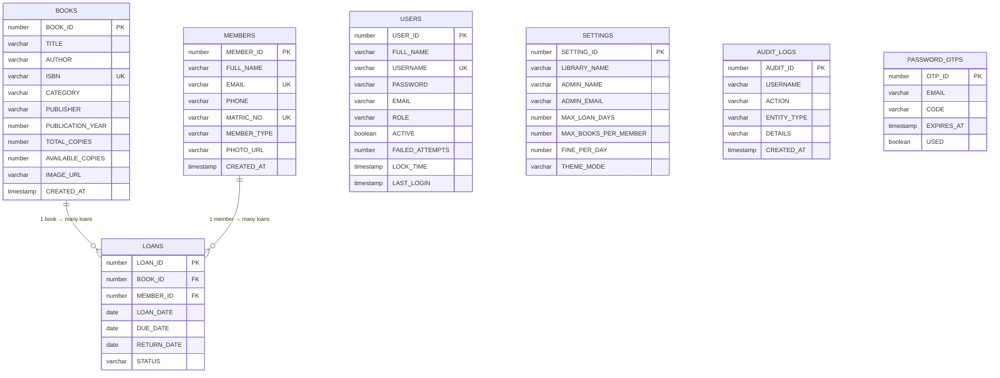
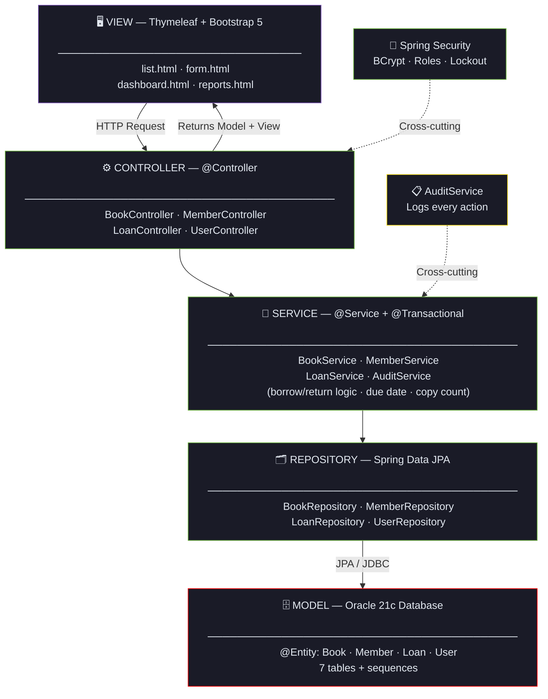
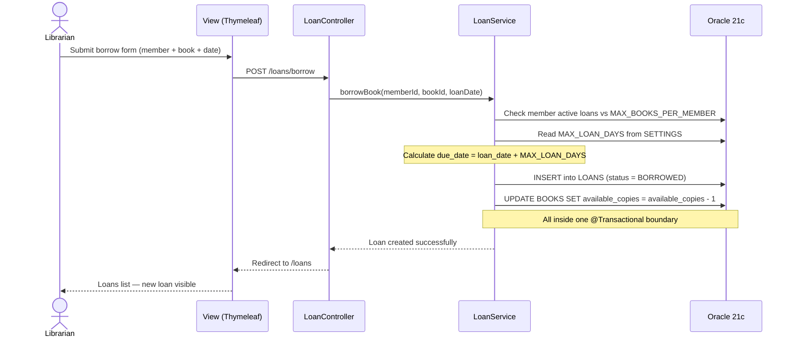

<div align="center">


# 🏛️ Library Pro
### *Enterprise Library Management System — CSC3402 / CCS3402*

[](https://librarydatabaseproject-production.up.railway.app)
[](#)
[](#)
[](#)
[](#)
[](#)
[](#)
[](#)
[](LICENSE)

> *A production-ready, full-stack web application for managing library operations — books, members, loans, reports and more.*

**[🌐 Try the Live System](https://librarydatabaseproject-production.up.railway.app)**

</div>

---

## 📋 Table of Contents

- [Overview](#-overview)
- [Live Demo](#-live-demo)
- [Features](#-features)
- [Tech Stack](#-tech-stack)
- [Database Design](#-database-design)
- [MVC Architecture](#-mvc-architecture)
- [Business Rules](#-business-rules)
- [Getting Started](#-getting-started)
- [Deployment](#-deployment)
- [Test Cases](#-test-cases)
- [Project Team](#-project-team)

---

## 🌟 Overview

**Library Pro** is a web-based database application built for the **CSC3402 / CCS3402 — Database Application Development** course at Universiti Putra Malaysia (UPM). It is a fully functional Library Management System that helps library staff manage books, register members, and handle the complete borrowing and return lifecycle.

The system demonstrates:
- ✅ **Full CRUD operations** across three related database tables (Books, Members, Loans)
- ✅ **MVC architecture** using the Spring framework with a clean layered structure
- ✅ **Relational database design** normalised to Third Normal Form (7 tables, Oracle 21c)
- ✅ **Role-based access control** via Spring Security (Admin, Librarian, Staff, Member)
- ✅ **Cloud deployment** on Railway with persistent file storage and CI/CD via GitHub

> Built for **CSC3402 / CCS3402 — Database Application Development** — UPM, Semester 2, 2025/2026.

---

## 🌐 Live Demo

| | |
|---|---|
| **Live URL** | [https://librarydatabaseproject-production.up.railway.app](https://librarydatabaseproject-production.up.railway.app) |
| **Platform** | Railway Cloud (auto-deploys from GitHub) |
| **Default Admin** | Username: `Dawood` · Request access from admin |
| **Status** | 🟢 Online |

---

## ✨ Features

### 📚 Books Module
- Add, view, edit, and delete books from the library catalogue
- Fields: Title, Author, ISBN (unique, 10 or 13 digits), Category, Publisher, Publication Year, Language, Edition, Shelf Location, Total Copies, Cover Image
- Upload book cover images (stored on Railway Volume for persistence)
- Search by title, author, or ISBN · Filter by category
- Export catalogue to **PDF**, **Excel**, and **CSV**

### 👥 Members Module
- Register, view, update, and remove library members
- Fields: Full Name, Email (unique), Phone, Matric/Staff No. (unique), Member Type (Student/Staff), Profile Photo
- Search by name or matric number

### 📋 Loans Module
- Borrow and return books with a full transaction history
- Auto-calculates due date from library settings (Loan Date + Max Loan Days)
- Status tracking: **BORROWED** · **RETURNED** · **OVERDUE**
- Automatic overdue detection via scheduled background job
- Fine calculation: Days Overdue × Fine Per Day (from Settings)

### 📊 Reports & Analytics
- Dashboard with live KPIs: Total Books, Available Copies, Total Members, Active Loans, Overdue Books
- Monthly Borrowing chart (last 6 months)
- Most Borrowed Books ranking
- Most Active Members ranking
- Loan Status Distribution (doughnut chart)
- Books by Category (bar chart)
- Book Availability (doughnut chart)

### 🔐 Security & User Management
- Spring Security with BCrypt password hashing
- 4 roles: **ADMIN** · **LIBRARIAN** · **STAFF** · **MEMBER**
- Account lockout after failed login attempts
- Forgot password via email OTP flow
- Full user management panel (Admin only)
- Profile photo upload and personal settings

### ⚙️ System Settings (Admin Only)
- Library name, address, contact number
- Administrator name and email (shown on forgot-password page)
- Max loan days · Max books per member · Fine per day (RM)
- Email notifications for overdue loans
- Theme mode: Auto / Light / Dark

### 🗂️ Audit Logs
- Every Create / Update / Delete / Login event logged automatically
- Fields: Username, Action, Entity Type, Details, Timestamp

---

## 🛠️ Tech Stack

| Layer | Technology | Version |
|---|---|---|
| **Language** | Java | 21 |
| **Framework** | Spring Boot (MVC, Data JPA, Security) | 3.2 |
| **View / Templating** | Thymeleaf + Bootstrap 5 | — |
| **Database** | Oracle 21c XE (H2 in-memory for demo) | 21c |
| **ORM** | Spring Data JPA (Hibernate) | — |
| **Build Tool** | Apache Maven | 3.x |
| **IDE** | IntelliJ IDEA | — |
| **Version Control** | Git + GitHub | — |
| **Cloud Deployment** | Railway | — |
| **File Storage** | Railway Volume (persistent) | — |
| **PDF Export** | OpenPDF | — |
| **Excel Export** | Apache POI | — |
| **Email** | Spring Mail | — |

---

## 🗃️ Database Design

Designed using relational modelling principles and normalised to **Third Normal Form (3NF)**. The database consists of **7 tables**.

### Core Tables



### Supporting Tables (No Foreign Keys)

| Table | Purpose |
|---|---|
| **USERS** | System login accounts — BCrypt-hashed passwords, roles (ADMIN/LIBRARIAN/STAFF/MEMBER), account lockout, last login |
| **SETTINGS** | Library configuration — name, max loan days, max books per member, fine per day, theme |
| **AUDIT_LOGS** | Every create/update/delete/login event with username, action, entity type, details, timestamp |
| **PASSWORD_OTPS** | 6-digit OTP codes for email-based password reset flow |

### Key Constraints

```sql
-- BOOKS
BOOK_ID        NUMBER(19)      PRIMARY KEY  (sequence-generated)
ISBN           VARCHAR2(20)    UNIQUE       (10 or 13 digits validated)
TOTAL_COPIES   NUMBER(10)      CHECK (>= 1)
AVAILABLE_COPIES NUMBER(10)    CHECK (>= 0)

-- MEMBERS  
MEMBER_ID      NUMBER(19)      PRIMARY KEY  (sequence-generated)
EMAIL          VARCHAR2(120)   UNIQUE
MATRIC_NO      VARCHAR2(20)    UNIQUE
MEMBER_TYPE    VARCHAR2(20)    CHECK IN (STUDENT, STAFF)

-- LOANS
LOAN_ID        NUMBER(19)      PRIMARY KEY  (sequence-generated)
BOOK_ID        NUMBER(19)      FOREIGN KEY  REFERENCES BOOKS(BOOK_ID)
MEMBER_ID      NUMBER(19)      FOREIGN KEY  REFERENCES MEMBERS(MEMBER_ID)
STATUS         VARCHAR2(15)    CHECK IN (BORROWED, RETURNED, OVERDUE)
```

---

## 🏗️ MVC Architecture



**Request Flow Example — Borrowing a Book:**

```

```

---

## 📐 Business Rules

| Rule | Implementation |
|---|---|
| **Copy tracking** | Borrow decrements `AVAILABLE_COPIES`; return increments it — inside one transaction |
| **Due date** | `LOAN_DATE + MAX_LOAN_DAYS` read from `SETTINGS` table |
| **Loan limit** | Member blocked from borrowing if active loans ≥ `MAX_BOOKS_PER_MEMBER` |
| **Overdue detection** | Scheduled job flags loans `OVERDUE` when `DUE_DATE < TODAY` and `RETURN_DATE IS NULL` |
| **Overdue fine** | `Days Overdue × FINE_PER_DAY` (configurable in Settings) |
| **Account lockout** | Login blocked after repeated failed attempts (`FAILED_ATTEMPTS`, `LOCK_TIME` in USERS) |

---

## 🚀 Getting Started

### Prerequisites

| Tool | Purpose |
|---|---|
| Java 21+ | Runtime |
| Apache Maven 3.6+ | Build tool |
| Oracle Database 21c XE | Production database |
| IntelliJ IDEA | Recommended IDE |

### Local Setup (Oracle)

```bash
# 1. Clone the repository
git clone https://github.com/dawoodnadeem9914/Library_Database_Project.git
cd Library_Database_Project

# 2. Configure your Oracle database connection
# Edit src/main/resources/application.properties:
# spring.datasource.url=jdbc:oracle:thin:@localhost:1521:XE
# spring.datasource.username=YOUR_DB_USER
# spring.datasource.password=YOUR_DB_PASSWORD

# 3. Configure file upload directory
# app.upload-dir=uploads

# 4. Build and run
mvn clean install
mvn spring-boot:run

# 5. Open the app
# http://localhost:8080
```

### Quick Demo (H2 In-Memory)

```bash
# Run with the H2 demo profile — no Oracle installation needed
mvn spring-boot:run -Dspring-boot.run.profiles=demo
# Opens at http://localhost:8080
# H2 console: http://localhost:8080/h2-console
```

### Default Login Credentials

| Role | Username | Password |
|---|---|---|
| Admin | `admin` | `Admin@123` |
| Librarian | `librarian` | `Lib@1234` |

> ⚠️ Change all credentials before any public deployment.

---

## ☁️ Deployment

### Railway Cloud Platform

```
Developer (IntelliJ + Git)
         │
         │ git push
         ▼
GitHub Repository ──── auto-deploy ────► Railway Cloud Platform
                                               │
                         ┌─────────────────────┤
                         ▼                     ▼
               Spring Boot App           Oracle DB
                  (container)           (JPA / JDBC)
                         │
                         ▼
               Railway Volume
              /app/uploads (persistent)
              book covers + member photos
```

**Key deployment changes from localhost:**
```properties
# Local
app.upload-dir=uploads

# Railway (production)
app.upload-dir=/app/uploads
```

A Railway Volume named `uploads` is mounted at `/app/uploads` to ensure uploaded book covers and member photos **survive redeployments**.

**CI/CD:** Every `git push` to `main` automatically triggers a new Railway deployment.

---

## ✅ Test Cases

| ID | Test Case | Expected Result | Module | Status |
|---|---|---|---|---|
| T1 | Add a new book with valid details | Book saved; appears in catalogue | Books (Create) | ✅ Pass |
| T2 | Add a book with a duplicate ISBN | Validation error; book rejected | Books (Create) | ✅ Pass |
| T3 | Search book by title / author / ISBN | Matching books listed | Books (Read) | ✅ Pass |
| T4 | Edit a book's number of copies | Updated value saved and shown | Books (Update) | ✅ Pass |
| T5 | Delete a book | Book removed from catalogue | Books (Delete) | ✅ Pass |
| T6 | Register a new member | Member saved with unique matric no. | Members (Create) | ✅ Pass |
| T7 | Add member with duplicate email | Validation error shown | Members (Create) | ✅ Pass |
| T8 | Borrow a book | Loan created; available copies −1 | Loans (Create) | ✅ Pass |
| T9 | Borrow beyond member limit | Blocked with a clear message | Loans (Create) | ✅ Pass |
| T10 | Return a borrowed book | Status = RETURNED; copies +1 | Loans (Update) | ✅ Pass |
| T11 | Overdue detection | Past-due loan flagged OVERDUE | Loans (Read) | ✅ Pass |

---

## 👥 Project Team

**CSC3402 / CCS3402 — Database Application Development**
**Universiti Putra Malaysia (UPM) — Semester 2, 2025/2026**

| No. | Name | Matric No. | Role | Responsibilities |
|---|---|---|---|---|
| 1 | **Dawood Nadeem** | 226920 | **Team Leader** | Project setup, database design, backend logic, Spring Boot, Oracle schema, Books & Loans modules, Spring Security, GitHub management |
| 2 | Fawzia Moradi | 226553 | Developer | Thymeleaf templates, Members module, Reports page, testing, project report |

---

## 📬 Contact

**Dawood Nadeem**
BSc Computer Science @ University Putra Malaysia (UPM)
📧 [Captaindawood12@gmail.com](mailto:Captaindawood12@gmail.com)
🔗 [GitHub](https://github.com/dawoodnadeem9914)

---

<div align="center">

*⭐ Star this repo if you found it useful! &nbsp;|&nbsp; [🌐 Try it live](https://librarydatabaseproject-production.up.railway.app)*


</div>
